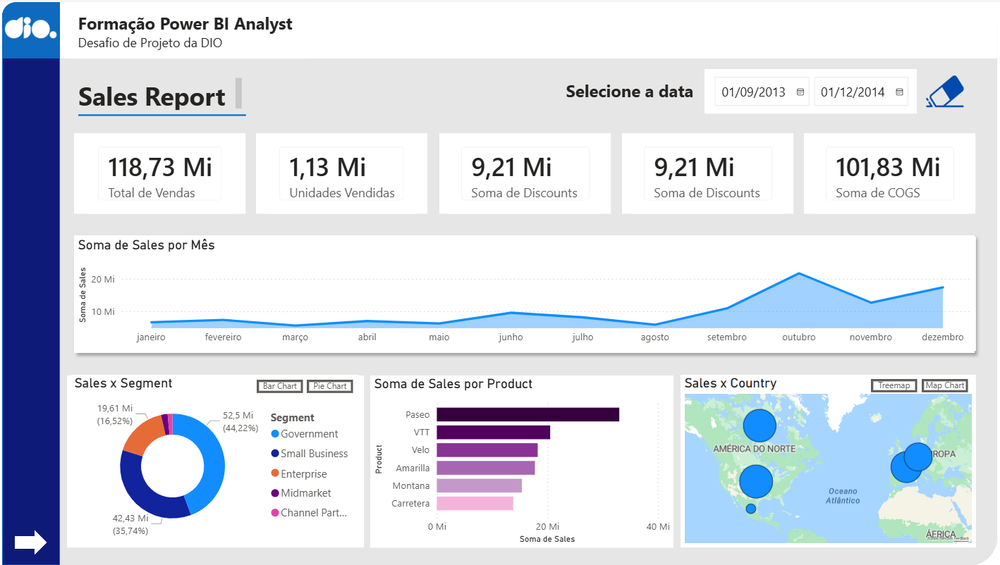
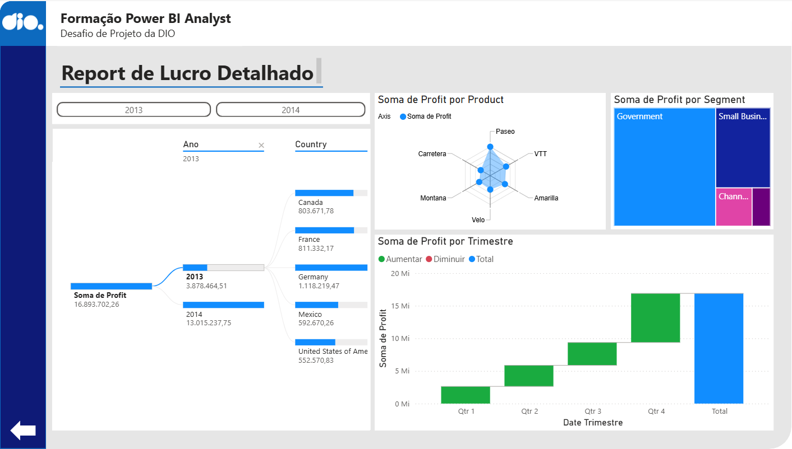

# Relatório – Power BI

## Sobre o projeto

Este projeto foi desenvolvido como parte de um desafio prático da formação Power BI Analyst da DIO.

A proposta foi construir um relatório interativo no Power BI, seguindo uma estrutura definida, com foco na organização visual, navegabilidade e uso de elementos interativos.

---

## Objetivo

* desenvolver um relatório com layout estruturado
* aplicar botões de navegação entre páginas
* utilizar segmentadores de dados para interação
* criar visuais dinâmicos com base nos indicadores
* construir uma segunda página de análise

---

## Estrutura do relatório

O relatório é composto por duas páginas:

### Página 1 – Visão geral

Contém:

* segmentadores de data
* botões de navegação
* organização visual do layout
* gráficos de vendas e distribuição dos dados

Além disso, foram utilizados botões para alternar visualizações:

* o gráfico de barras pode ser alternado para gráfico de rosca
* o mapa pode ser alternado para um treemap

A página também conta com um botão de limpar filtros, que retorna o dashboard ao estado inicial.

---

### Página 2 – Análise de lucro

Focada na análise detalhada do lucro, contendo:

* análise de lucro por produto
* análise por segmento
* decomposição do lucro por país
* análise ao longo do tempo

Essa página permite explorar com mais profundidade os fatores que influenciam o lucro.

---

## Interatividade

O relatório conta com:

* segmentadores de dados para filtragem dinâmica
* botões de navegação entre páginas (avançar e voltar)
* interação entre os gráficos
* botões para alternar diferentes tipos de visualização
* botão de reset para limpar filtros e retornar ao estado inicial

---

## Sobre os dados

A base de dados foi disponibilizada pela plataforma DIO como parte de um desafio prático do curso.

---

## Ferramentas utilizadas

* Power BI
* gráficos (linha, barra, rosca, treemap, radar, cascata e árvore de decomposição)
* mapas geográficos
* segmentadores de dados
* botões e navegação

---

## Como visualizar o projeto

1. Baixe o arquivo `.pbix` disponível neste repositório
2. Abra no Power BI Desktop
3. Utilize os filtros e botões para navegar e explorar o relatório

---

## Preview do Dashboard

---

## Autora

Bruna Dionísio, estudante de Ciência de Dados.
